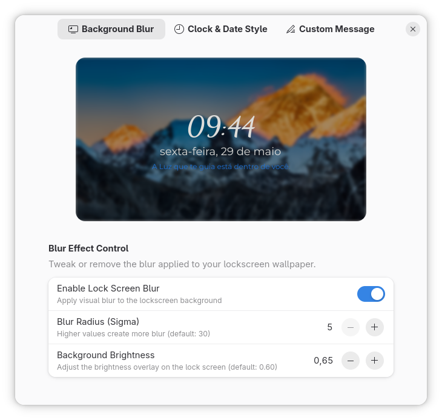
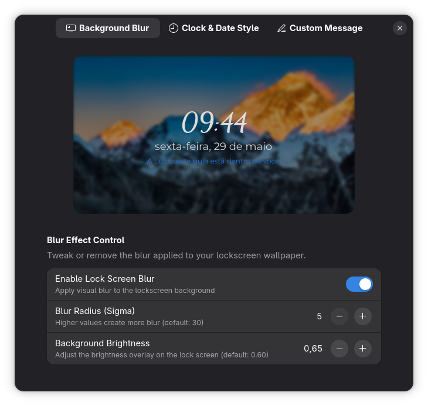
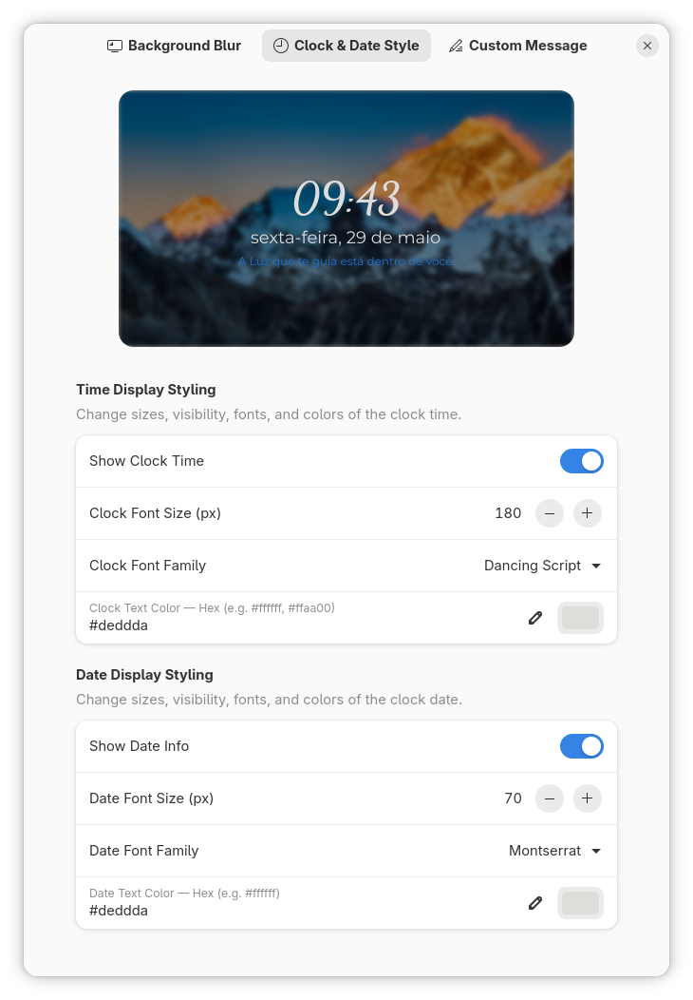
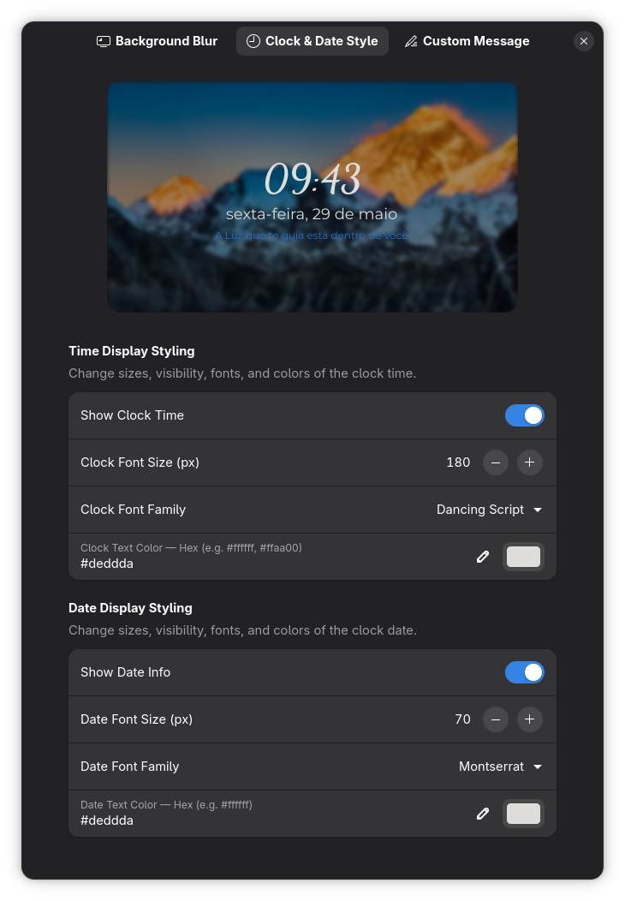
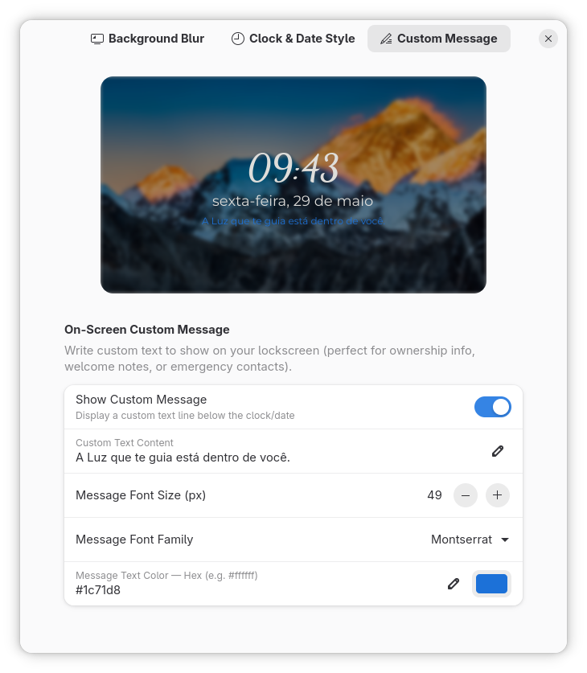
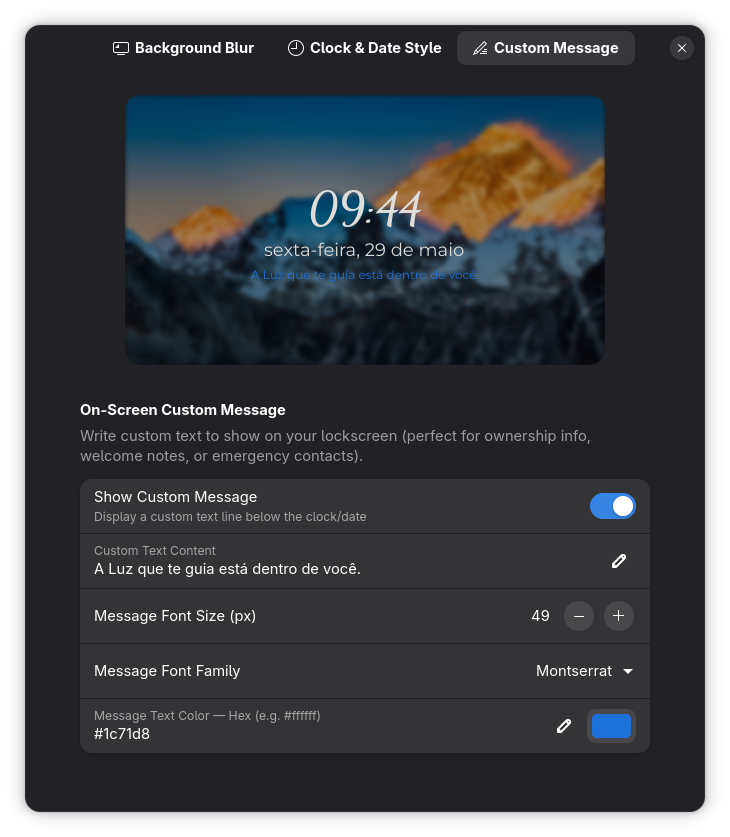

# 🌟 Lockscreen Studio 🌟

A modern and premium GNOME Shell extension to fully customize and control your lock screen experience. Compatible with **GNOME 46, 47, and 48**.

Built completely with **ES Modules (ESM)** and optimized for modern GNOME design guidelines using GTK4 and Libadwaita.

---

## 📸 Screenshots

### Blur Control
| Light Mode | Dark Mode |
|:---:|:---:|
|  |  |

### Clock & Date Customization
| Light Mode | Dark Mode |
|:---:|:---:|
|  |  |

### Custom Message
| Light Mode | Dark Mode |
|:---:|:---:|
|  |  |

---

## ✨ Features

*   **🔮 Wallpaper Blur Control**: 
    *   Enable or disable the blur effect on the lockscreen wallpaper completely.
    *   Fine-tune the **blur radius** (sigma) dynamically.
    *   Adjust the **overlay brightness** (from completely dark to original wallpaper brightness).
*   **⏰ Clock Time Styling**:
    *   Toggle time visibility.
    *   Customize font sizes in pixels.
    *   Set custom **font families** (e.g. *Cantarell*, *Sans*, *Ubuntu*, *system-ui*).
    *   Change text color using Hex codes.
*   **📅 Date Display Styling**:
    *   Toggle date visibility.
    *   Set custom font sizes, families, and colors.
*   **✍️ On-Screen Custom Message**:
    *   Display a premium custom message below the lockscreen clock (welcome text, ownership info, emergency contact, or quotes).
    *   Adjust font size, family, and custom text color.
*   **🎨 Libadwaita Preferences**:
    *   Beautiful, premium, and native preferences window fully aligned with standard GNOME styles.
    *   Interactive controls (switches, adjust spinrows, and entries) that update settings in real-time.

---

## 📁 File Structure

```
lockscreen-studio@pedro.projects/
├── metadata.json           # Extension descriptor and metadata
├── extension.js            # Main entry point (monkey-patches UnlockDialog)
├── prefs.js                # Premium GTK4/Libadwaita settings window
├── install.sh              # Automatic installation script
├── README.md               # Documentation
└── schemas/
    ├── org.gnome.shell.extensions.lockscreen-studio.gschema.xml # Configuration GSchema
    └── gschemas.compiled   # Compiled GSettings binary schema
```

---

## 🚀 Installation & Activation

We've provided a simple installer script to copy the files to your local extension directory and compile the GSettings schemas automatically.

### 1. Run the installer script:
In this folder, execute:
```bash
./install.sh
```

### 2. Activate the Extension:
Since GNOME Shell caches extensions on startup, the activation process depends on your windowing system:

*   **Wayland (Default on modern distros)**:
    1. Log out of your session and log back in.
    2. Open **Extension Manager** or the **Extensions** app.
    3. Find **Lockscreen Studio** and toggle it **ON**.
    
*   **X11**:
    1. Press `Alt + F2`, type `r`, and press `Enter` to restart GNOME Shell.
    2. Enable the extension using:
       ```bash
       gnome-extensions enable lockscreen-studio@pedro.projects
       ```

---

## 🛠️ Technology & Architecture

*   **Monkey-Patching Prototypes**: Overrides the internal `UnlockDialog` prototype `_init` and `_updateBackgroundEffects` to intercept clock rendering and background blur styling.
*   **Dynamic Resource Release**: The `disable()` hook cleans up all active overrides, deletes custom properties, detaches added custom elements (like labels), and triggers the native background effects to restore the lock screen perfectly to its original state.
*   **Bidirectional Gio.Settings Binding**: Binds GTK4 preferences widgets directly to GSettings for zero-boilerplate state synchronization.

---

*Made with 💖 for GNOME Shell.*
